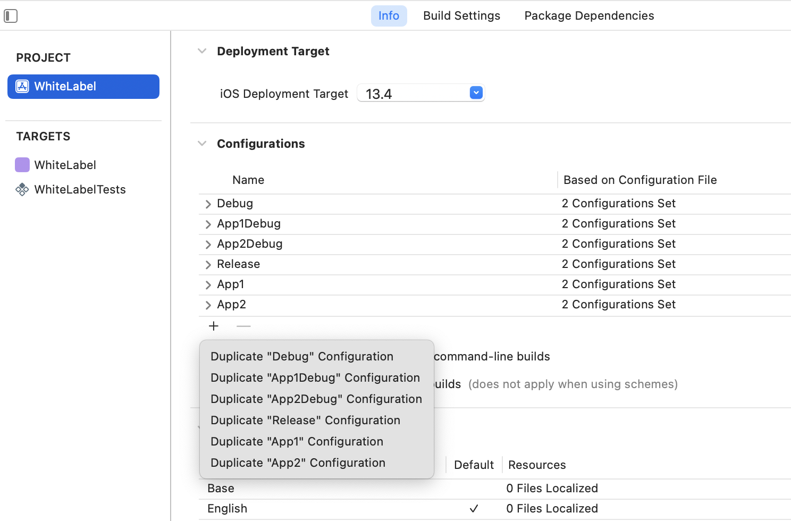
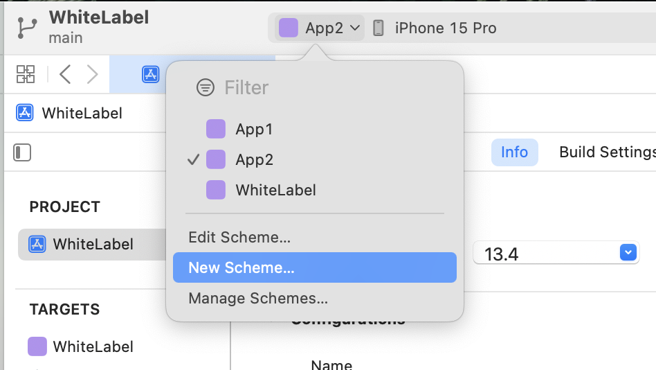
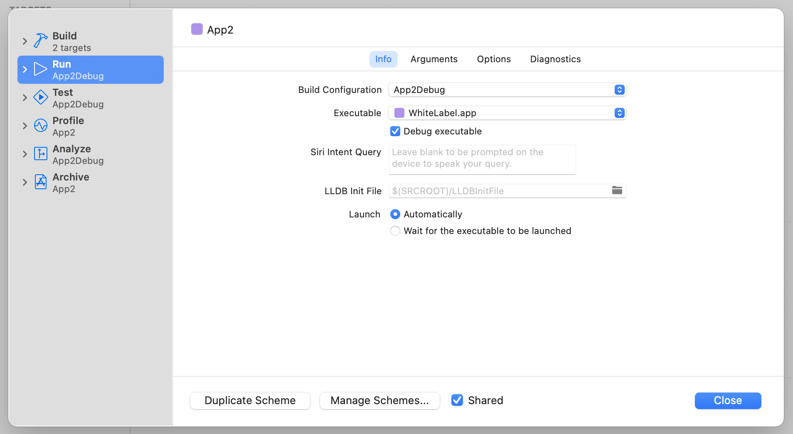
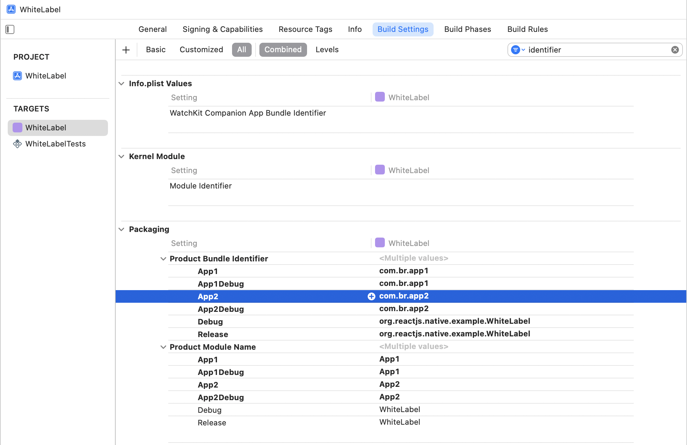
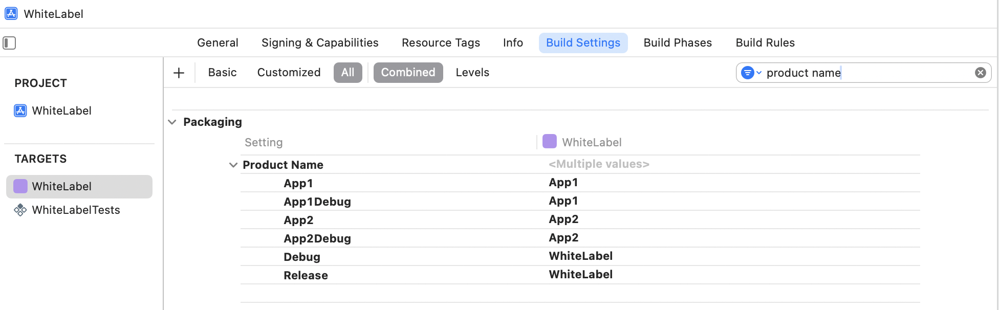

# Adding a new iOS App

To integrate a new iOS app into your React Native project, follow these steps:

<br>

## 1. Open Xcode

Open a new terminal and run the following command:

```bash
yarn xcode
```

<br>

## 2. Duplicate configurations

Duplicate `release` and `debug` configurations:



<br>

## 3. Create a new scheme

Create a new scheme with the new app name:


<br>

## 4. Edit the scheme:

Change every build configurations to your new app:



<br>

## 5. Edit packaging settings:

Update the bundle identifier and module name:



<br>

## 6. Edit app name:

Update your app name:



<br>

These steps ensure that your new iOS app is properly configured within Xcode. Adjust the details according to your specific app requirements. After completing these steps, you should be able to build and run your new iOS app using Xcode.
